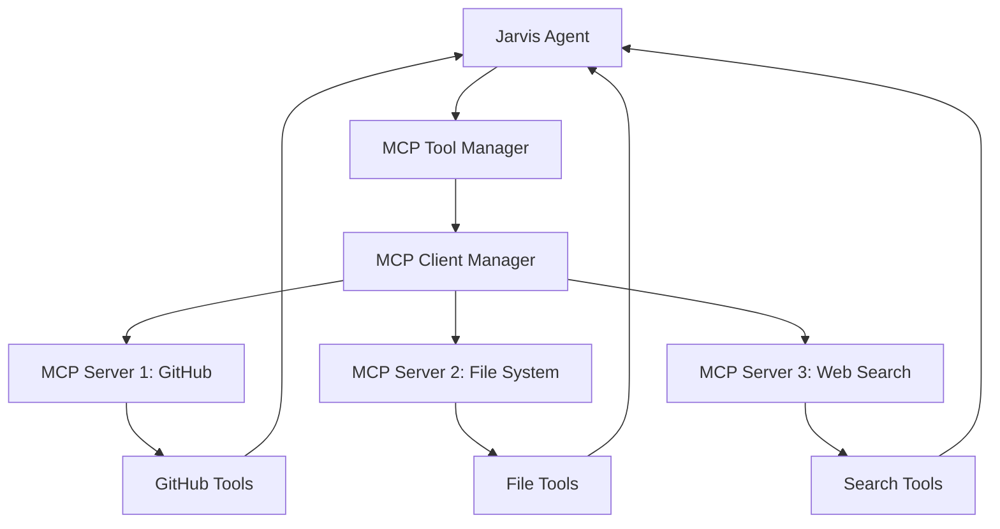

# MCP Integration Guide for Jarvis Voice Assistant

## Overview

The Model Context Protocol (MCP) integration allows Jarvis to connect to external tools and services dynamically without modifying the core codebase. This system provides a secure, extensible way to add capabilities like GitHub integration, file system access, web search, database connections, and more.

## Table of Contents

1. [Quick Start](#quick-start)
2. [Understanding MCP](#understanding-mcp)
3. [Using the MCP Management Interface](#using-the-mcp-management-interface)
4. [Server Templates](#server-templates)
5. [Manual Configuration](#manual-configuration)
6. [Security & Best Practices](#security--best-practices)
7. [Troubleshooting](#troubleshooting)
8. [Advanced Usage](#advanced-usage)

## Quick Start

### Prerequisites

- **Node.js** (required for most MCP servers)
- **Jarvis Voice Assistant** running
- **Internet connection** for downloading MCP servers

### Add Your First MCP Server

1. **Start Jarvis UI**:
   ```bash
   cd jarvis
   python ui/jarvis_ui.py
   ```

2. **Access MCP Management**:
   - Navigate to **Settings** → **MCP Tools & Servers**
   - Or go directly to: `http://localhost:8080/mcp`

3. **Add Memory Server** (no setup required):
   - Click **"Add Server"**
   - Select **"Memory Storage"** from template dropdown
   - Click **"Test Connection"** → Should show "Configuration is valid"
   - Click **"Add Server"** → Success notification appears

4. **Connect and Use**:
   - Click **"Connect"** next to your new server
   - Tools will be discovered automatically
   - Ask Jarvis: *"What tools do you have available?"*

## Understanding MCP

### What is MCP?

The Model Context Protocol (MCP) is an open standard that allows AI assistants to securely connect to external data sources and tools. It provides:

- **Standardized Communication**: JSON-RPC 2.0 protocol
- **Multiple Transports**: STDIO, HTTP/SSE, WebSocket
- **Tool Discovery**: Automatic enumeration of available capabilities
- **Security**: Sandboxed execution and permission controls

### How It Works in Jarvis



### Architecture Components

- **MCP Client Manager**: Handles server connections and communication
- **MCP Tool Adapter**: Converts MCP tools to LangChain-compatible tools
- **Configuration Manager**: Secure storage with encryption
- **Template System**: Pre-configured server setups
- **UI Management**: Web interface for server administration

## Using the MCP Management Interface

### Accessing the Interface

The MCP management interface is available at `/mcp` in the Jarvis UI:

```
http://localhost:8080/mcp
```

### Interface Sections

#### 1. Setup Guide
- Quick start instructions
- Prerequisites checklist
- Common troubleshooting tips

#### 2. Server Management
- **Server List**: Shows all configured servers with status
- **Add Server**: Modal for adding new servers
- **Server Actions**: Connect, disconnect, configure, remove

#### 3. Tool Browser
- **Available Tools**: All discovered tools from connected servers
- **Tool Status**: Enable/disable individual tools
- **Tool Information**: Descriptions and parameters

### Server Status Indicators

- 🟢 **Connected**: Server is active and tools are available
- 🟡 **Connecting**: Server connection in progress
- 🔴 **Disconnected**: Server is configured but not connected
- ❌ **Error**: Connection failed or server error

## Server Templates

Jarvis includes pre-configured templates for popular MCP servers:

### Available Templates

| Template | Description | Setup Required |
|----------|-------------|----------------|
| **GitHub Integration** | Repository management, issues, PRs | GitHub Personal Access Token |
| **File System Access** | Local file operations | None (specify directory) |
| **Brave Search** | Web search capabilities | Brave Search API Key |
| **Memory Storage** | Persistent conversation data | None |
| **SQLite Database** | Database queries and management | Database file path |
| **Google Drive** | Cloud storage access | Google API credentials |
| **Slack Integration** | Team communication | Slack Bot Token |
| **PostgreSQL** | Database operations | Database connection URL |
| **Web Automation** | Browser control with Puppeteer | None |
| **Everything Search** | Windows file search | Everything app installed |

### Using Templates

1. **Select Template**: Choose from dropdown in "Add Server" modal
2. **Auto-Fill**: Form fields populate with template values
3. **Customize**: Modify settings as needed (API keys, paths, etc.)
4. **Test**: Validate configuration before adding
5. **Add**: Server is added and ready to connect

## Manual Configuration

### Transport Types

#### STDIO (Process-based)
Most common transport for MCP servers:

```
Transport: STDIO
Command: npx
Arguments: -m @modelcontextprotocol/server-github
Environment: GITHUB_TOKEN=your_token_here
```

#### HTTP/SSE (Server-Sent Events)
For web-based MCP servers:

```
Transport: HTTP/SSE
URL: https://api.example.com/mcp
Headers: Authorization: Bearer your_token
Timeout: 30 seconds
```

#### WebSocket
For real-time bidirectional communication:

```
Transport: WebSocket
URL: wss://api.example.com/mcp
Headers: Authorization: Bearer your_token
Timeout: 30 seconds
```

### Configuration Fields

#### Required Fields
- **Server Name**: Unique identifier for the server
- **Transport Type**: Communication method (STDIO/SSE/WebSocket)

#### STDIO-Specific Fields
- **Command**: Executable command (e.g., `npx`, `python`, `node`)
- **Arguments**: Command arguments (space-separated)
- **Environment Variables**: Key=value pairs (one per line)
- **Working Directory**: Optional execution directory

#### HTTP/WebSocket-Specific Fields
- **Server URL**: Full URL to MCP endpoint
- **Headers**: HTTP headers (Header: value format, one per line)
- **Timeout**: Connection timeout in seconds (default: 30)

## Security & Best Practices

### Data Protection

1. **Encrypted Storage**: All sensitive data (API keys, tokens) is encrypted at rest
2. **Secure Communication**: MCP protocol includes built-in security measures
3. **Process Isolation**: STDIO servers run in separate processes
4. **Permission Controls**: Framework ready for user approval workflows

### Best Practices

#### API Key Management
- Store API keys in environment variables, not in arguments
- Use minimal required permissions for tokens
- Rotate keys regularly
- Never commit keys to version control

#### Server Configuration
- Test connections before adding servers
- Use descriptive server names
- Keep servers updated to latest versions
- Monitor server logs for issues

#### Network Security
- Use HTTPS/WSS for web-based servers
- Validate SSL certificates
- Use authentication headers properly
- Set appropriate timeouts

### Example Secure Configuration

```bash
# Environment variables (recommended)
export GITHUB_TOKEN="ghp_xxxxxxxxxxxxxxxxxxxx"
export BRAVE_API_KEY="BSA-xxxxxxxxxxxxxxxxxxxx"

# In Jarvis MCP configuration:
# Server Name: GitHub Integration
# Transport: STDIO
# Command: npx
# Arguments: -m @modelcontextprotocol/server-github
# Environment: GITHUB_TOKEN=${GITHUB_TOKEN}
```

## Troubleshooting

### Common Issues

#### Server Won't Connect
1. **Check Prerequisites**: Ensure Node.js and MCP server are installed
2. **Verify Command**: Test command manually in terminal
3. **Check Environment**: Ensure environment variables are set
4. **Review Logs**: Check Jarvis logs for detailed error messages

#### Tools Not Appearing
1. **Server Status**: Ensure server is connected (green indicator)
2. **Tool Discovery**: Wait for automatic tool discovery to complete
3. **Refresh Tools**: Use refresh button in UI
4. **Check Permissions**: Verify API tokens have required permissions

#### Configuration Errors
1. **Validation**: Use "Test Connection" before adding servers
2. **Syntax**: Check environment variables and headers format
3. **URLs**: Ensure URLs are properly formatted with protocol
4. **Timeouts**: Increase timeout for slow connections

### Debug Commands

```bash
# Check MCP server installation
npm list -g | grep modelcontextprotocol

# Test server manually
npx -m @modelcontextprotocol/server-github

# Check Jarvis logs
tail -f jarvis_debug.log

# Verify configuration file
cat ~/.jarvis/mcp_servers.json
```

### Log Analysis

Jarvis logs MCP activities with these prefixes:
- `jarvis.core.mcp_client`: Client manager operations
- `jarvis.core.mcp_tool_adapter`: Tool conversion and execution
- `jarvis.core.mcp_config`: Configuration management
- `jarvis.tools`: Tool loading and integration

## Advanced Usage

### Custom MCP Servers

You can create custom MCP servers for specialized needs:

1. **Follow MCP Specification**: Use official MCP SDK
2. **Implement Required Methods**: `initialize`, `tools/list`, `tools/call`
3. **Add to Jarvis**: Use manual configuration with custom command
4. **Test Thoroughly**: Ensure proper error handling and security

### Programmatic Access

Access MCP functionality programmatically:

```python
from jarvis.tools import get_mcp_client, get_mcp_tool_manager

# Get MCP client
mcp_client = get_mcp_client()

# Add server programmatically
from jarvis.core.mcp_client import MCPServerConfig, MCPTransportType

config = MCPServerConfig(
    name="my-custom-server",
    transport=MCPTransportType.STDIO,
    command="python",
    args=["my_mcp_server.py"],
    enabled=True
)

success = mcp_client.add_server(config)

# Get tool manager
tool_manager = get_mcp_tool_manager()
tools = tool_manager.get_langchain_tools()
```

### Integration with Existing Tools

MCP tools integrate seamlessly with existing Jarvis tools:

```python
# In conversation, all tools are available together
from jarvis.tools import get_langchain_tools

# Returns: built-in tools + plugin tools + MCP tools
all_tools = get_langchain_tools()
```

### Performance Optimization

1. **Connection Pooling**: Reuse connections when possible
2. **Tool Caching**: Cache tool metadata to reduce discovery time
3. **Async Operations**: All MCP operations are asynchronous
4. **Resource Limits**: Set appropriate timeouts and limits

## Next Steps

1. **Explore Templates**: Try different server templates
2. **Create Custom Servers**: Build specialized MCP servers for your needs
3. **Monitor Usage**: Review logs and performance metrics
4. **Stay Updated**: Keep MCP servers and Jarvis updated
5. **Community**: Share configurations and custom servers

For more information, see:
- [MCP Official Documentation](https://modelcontextprotocol.io/)
- [Jarvis Tool Development Guide](TOOL_DEVELOPMENT_GUIDE.md)
- [Security Best Practices](SECURITY.md)
